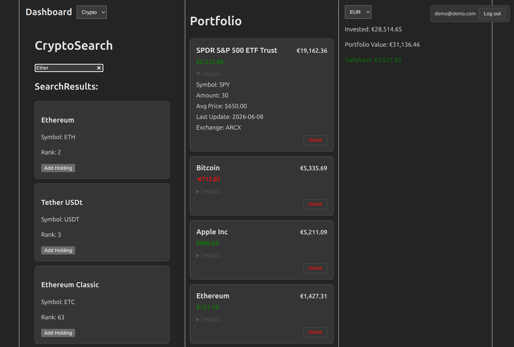

# CoreValora


Track crypto and stock holdings with live prices and multi-currency valuation — a full-stack app built with React, FastAPI and PostgreSQL.

--- 

## Screenshot



---

## Features

- **Search & add holdings:** find crypto and stocks by name or symbol and add them to your portfolio.
- **Live prices:** real-time crypto prices via CoinCap, end-of-day stock prices via MarketStack.
- **Multi-currency valuation:** portfolio value in any supported currency, using Frankfurter exchange rates.
- **TTL caching:** upstream responses are cached to reduce external API calls and speed up load times.
- **Fully dockerized:** the entire stack (frontend, backend, PostgreSQL) runs via `docker compose up`.

---

## Tech Stack

React 19 + Vite · FastAPI / Python 3.12 · PostgreSQL · Docker Compose

---

## Quickstart

### Prerequisites

- **Docker** — Docker Desktop on macOS/Windows, Docker Engine on Linux.
  Required for Option A, and for the database in Option B.
- For Option B only: **Python 3.12** and **Node 20+**.

> On **Windows**, run the commands below in **Git Bash** (ships with Git for
> Windows) so Unix commands like `cp` work. PowerShell alternatives are noted
> where they differ.

### 1. Configure environment

```bash
cp .env.example .env                 # set POSTGRES_PASSWORD in .env
cp backend/.env.example backend/.env # set MARKETSTACK_API_KEY and COINCAP_API_KEY in backend/.env
```

> PowerShell: use `Copy-Item .env.example .env` instead of `cp`.

You need two free API keys: [MarketStack](https://marketstack.com) (stocks) and
[CoinCap](https://pro.coincap.io) (crypto). For **Option B**, also set the
password in `backend/.env`'s `DB_URL` to match `POSTGRES_PASSWORD`.

### Option A — Docker (recommended)

Brings up frontend, backend and PostgreSQL together:

```bash
docker compose up
```

> After changing code or dependencies, add `--build` to rebuild the images:
> `docker compose up --build`.
- Frontend → http://localhost:5173
- Interactive API docs → http://localhost:8000/docs

### Option B — Run manually

Best when you're **actively developing**: backend and frontend run as separate
processes with **hot-reload**, so changes to either show up instantly without
rebuilding a container. Start only the database with Docker, then run the two
services natively in separate terminals.

```bash
docker compose up -d db
```

**Backend** (terminal 1):

```bash
cd backend
python3 -m venv .venv
source .venv/bin/activate         # Linux / macOS
# source .venv/Scripts/activate   # Windows (Git Bash)
# .venv\Scripts\Activate.ps1      # Windows (PowerShell)
pip install -r requirements.txt
alembic upgrade head              # apply database migrations
uvicorn main:app --reload         # http://localhost:8000
```

> On Windows, **Git Bash is the smoother path**: the `source ...` command and
> the Unix-style `cp` from step 1 work as-is. PowerShell needs an execution-policy
> tweak before `Activate.ps1` will run (e.g.
> `Set-ExecutionPolicy -Scope CurrentUser RemoteSigned`) and uses backslash paths.

**Frontend** (terminal 2):

```bash
cd frontend
npm install
npm run dev                      # http://localhost:5173
```


---

## Architecture

The backend follows a layered structure: **routers** handle HTTP and stay thin,
delegating to **services** that hold the business logic, which in turn call
**providers** — small clients wrapping each external API. User accounts,
portfolios and the market-data cache all live in PostgreSQL.

```
  Browser — React 19 + Vite
      │  REST (fetch)
      ▼
┌─────────────────────────────────────────────┐
│  FastAPI backend                            │
│                                             │
│   routers/    HTTP layer (thin)             │
│      │        auth · crypto · stock ·       │
│      ▼        currency · portfolio          │
│   services/   business logic + caching      │
│      │                                      │
│      ▼                                      │
│   providers/  external API clients          │
└──────┬───────────────┬────────────┬─────────┘
       ▼               ▼            ▼
    CoinCap        MarketStack   Frankfurter
    (crypto)       (stocks)      (FX rates)

   PostgreSQL ── users · portfolios · cached prices, searches & FX rates
```


**Design highlights:**

- **TTL caching** (`services/cache/`) — each upstream response is cached for a
  configurable lifetime, cutting external calls and staying within API rate
  limits.
- **Graceful degradation with stale cache** (`services/stock_service.py`,
  `services/crypto_service.py`) — when an upstream call fails, the last cached
  price is served flagged as `stale`. The UI shows a "Couldn't get the current
  price" note but still computes the portfolio value from the latest known
  price, instead of breaking the whole view.
- **MarketStack v2 with v1 for wider coverage** (`services/stock_service.py`,
  `routers/stock.py`) — v1 still lists instruments that v2 doesn't (e.g. several
  Swiss equities). For **pricing**, a lookup hits v2 first and falls back to v1
  on an HTTP 406 (returned for symbols MarketStack serves only on v1). For
  **search**, v2 results show by default and an **"Extend Search"** button pulls
  in additional v1 matches on demand. The point is instrument coverage, not
  uptime.
- **Exchange → currency mapping** (`services/currency/`) — the trading currency
  is derived from the exchange's MIC code instead of trusting MarketStack's own
  currency field, which is unreliable. This also guards against unsupported currencies entering valuation.

The interactive API reference (FastAPI auto-generated) is available at
[`/docs`](http://localhost:8000/docs) when the backend is running.


## Known Limitations

This is a v1 focused on getting the core flow right. Gaps I'm aware of and plan
to address:

- **Stock search ranking is rough for smaller / non-US companies:** results
  aren't always sorted sensibly — a company often shows up first on a larger
  (frequently US) exchange rather than its home exchange. Search ordering needs
  work.
- **No selling or partial position changes:** buying *more* of an asset works —
  adding to an existing holding recomputes the average price and sums the
  quantity correctly. But reducing or selling part of a position isn't supported
  yet; to do that you'd delete the holding and re-create it.
- **No transaction history:** a holding is stored as an aggregated position
  (average price + total quantity); current value and gain/loss are computed
  from that against the live price. A future version would instead record
  individual dated transactions (e.g. "2026-06-10 buy 0.2 BTC @ 50,000 USD") —
  the prerequisite for sells, partial changes, and portfolio-history charts over
  time.
- **Frontend rough edges:** several UX gaps remain — searches have no cancel
  button, and (more annoying) neither does the add-holding form: once you've
  opened it to enter price and quantity, there's no way to back out except
  reloading the page or switching between crypto and stock search. Long holding
  or result lists also scroll the whole page instead of their own container.
- **Email verification is not implemented:** accounts work immediately after
  sign-up without confirming the address.
- **Currency-rate cache grows unbounded:** unlike sessions and search results,
  cached FX rates are never purged. This is intentional — the accumulating rate
  history is meant to back the future portfolio-history feature described above.

---

## License

MIT — see [LICENSE](LICENSE).
